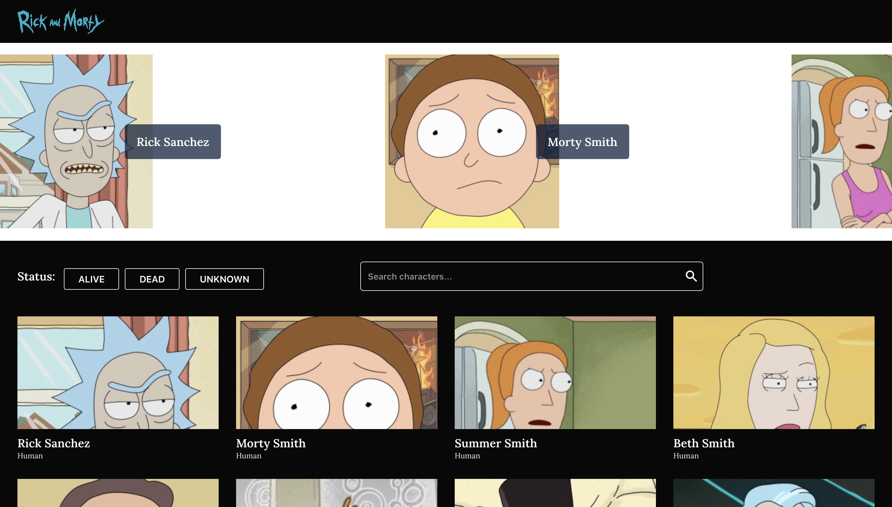
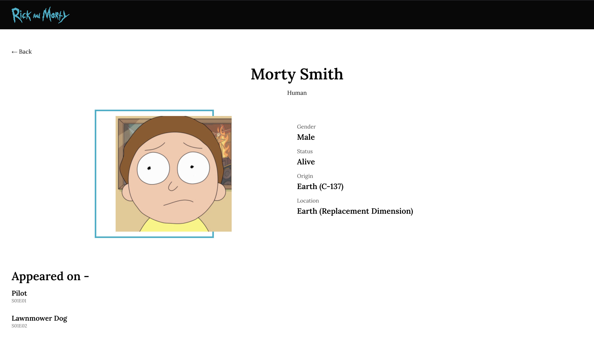
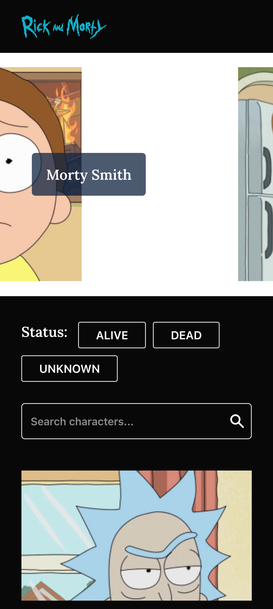
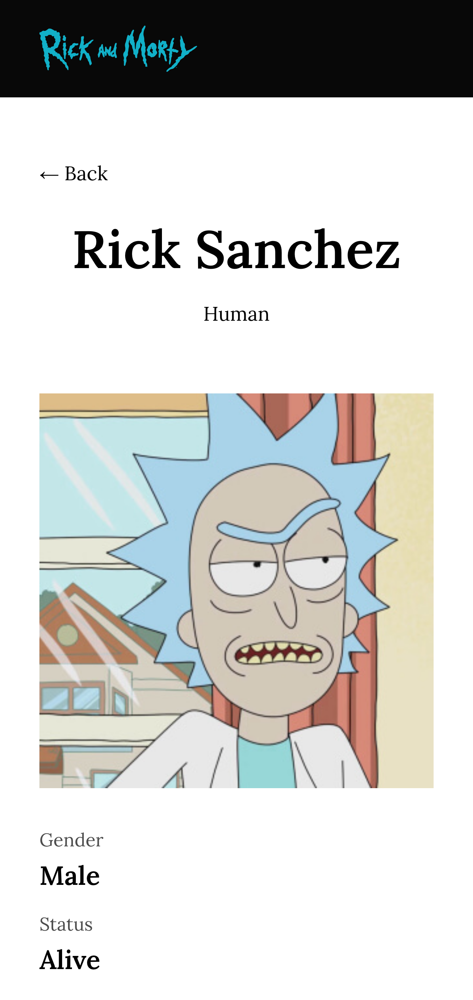

# RICK AND MORTY

Rick and Morty demo application that consumes the [RickandmortyApi](https://rickandmortyapi.com/). 

[View Demo](https://nv-rick-and-morty.netlify.app/)



## Features
 - Search
 - Filter
 - Caching
 - Responsive
 - Components

## Libraries Used
- react-query: https://react-query.tanstack.com/
- react-fast-marquee: https://www.react-fast-marquee.com/
- react-paginate: https://www.npmjs.com/package/react-paginate/
- axios: https://axios-http.com/.

##  Interesting Pattern

This Rick and Morty demo contains some interesting React pattern like hooks. for e.g

```
export const useCharacters = ({ page, name, status }) => {
    const characters = useQuery({
        queryKey: ["characters", page, name, status],
        queryFn: () => CharacterApis.getCharacters({ page, name, status }),
        keepPreviousData: true,
    })
    return characters;
}
```

This hook helps to abstract the call to get all rick and morty characters. 

```
const useApp = () => {
  const context = React.useContext(AppContext);
  if (context === undefined) {
    throw new Error(`useApp must be used within an AppProvider`);
  }
  return context;
};
```

This context hook helps to abstract the call to `React.useContext()` which would require inporting the AppContext all the time.

```
const contextReducer = (state, action) => ({...state, ...action});
const AppProvider = (props) => {
  const [parameter, setParameter] = React.useReducer(contextReducer, {
    page: "",
    status: "",
    name: "",
  });

  const value = [parameter, setParameter];
  return <AppContext.Provider value={value} {...props} />;
};
```

This useReducer is used to manage the state shared via context to the application. 

## Application Look



----


----


## Developement

1. [Fork](https://help.github.com/articles/fork-a-repo/) this repository to your own GitHub account and then [clone](https://help.github.com/articles/cloning-a-repository/) it to your local device.
2.  Install yarn: `npm install -g yarn`
3. Install the dependencies: `yarn`
4. The environment variable is intentionally allowed to be public so you do not need to recreate that
5.  Run `yarn start` to build and watch for code changes
